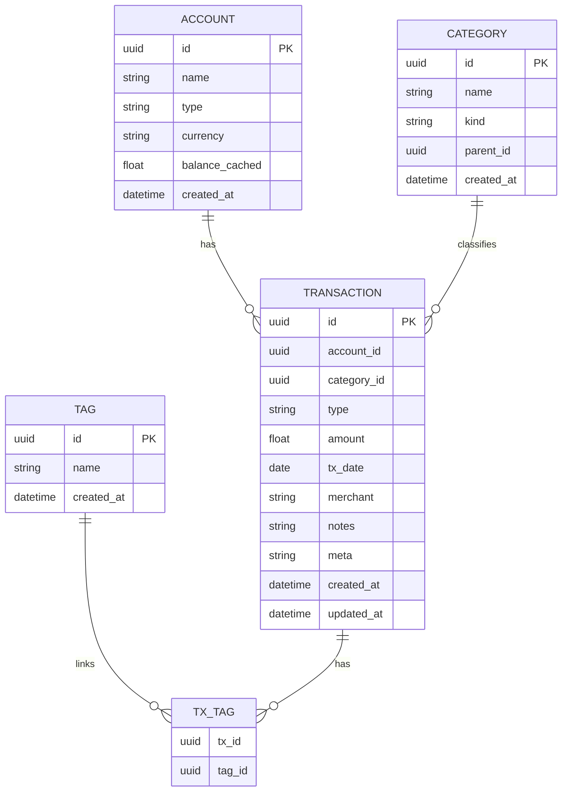

# Kakeibo — Zeny Wallet (KZW)

> **Propósito:** Aplicación web de uso personal para registrar gastos/ingresos, detallarlos y generar informes a medida. Enfocada en **privacidad**, **flexibilidad** y **extensibilidad**.

---

## 1) Visión & Alcance
- Llevar un **historial completo** de movimientos financieros (gastos, ingresos, transferencias).
- **Etiquetado flexible** (categorías + tags) y notas ricas.
- **Reportes** personalizados con filtros por rango temporal, cuenta, categoría, tag y merchant.
- **Datos 100% del usuario**: exportables, importables, con opción de cifrado local.
- **MVP**: experiencia single-user, offline oportunista; sin multiusuario.

### Principios
- **Local-first** (datos tuyos; sync opcional a futuro).
- **Transparencia de modelo de datos** (esquema claro y versionado).
- **Automatización** (reglas, recurrencias, imports, reconciliación).

---

## 2) Roadmap (Iterativo por hitos)

### Hito 0 — Bootstrap 
- Repo monorepo (`kzw/`): frontend (Next.js), backend (FastAPI), DB (PostgreSQL), infra (Docker).
- Pipeline CI (GitHub Actions): lint + test + build.
- Plantilla UI (Tailwind + shadcn/ui), tema oscuro por defecto.

### Hito 1 — MVP CRUD 
- Autenticación single-user (password local + sesión segura/JWT). 
- CRUD de **Cuentas**, **Categorías**, **Transacciones** (gasto/ingreso/transferencia).
- Listado, detalle, edición in-line, búsqueda simple.
- Esquema DB v1 + migraciones Alembic.

### Hito 2 — Productividad
- **Recurrencias** (mensual/semanal/custom) con posteos automáticos.
- **Tags** múltiples por transacción.
- **Import CSV** (plantillas: banco, tarjeta, genérico).
- **Reconciliación**/duplicados (reglas simples por monto+fecha+merchant).

### Hito 3 — Reportes
- Resumen mensual/por rango: totales, por categoría, por cuenta.
- Gráficos (barras/series/rosca) y export **CSV/JSON**.
- Presupuesto mensual por categoría (soft-limit con alertas visuales).

### Hito 4 — Calidad de vida
- Búsqueda avanzada (filtros combinados, guardados).
- Reglas de auto-categorización (regex/contiene merchant -> categoría, tags).
- Copias de seguridad y **cifrado local** opcional (AES-256 en repositorio local).

### Backlog
- OCR de recibos, import QIF/OFX.
- Multiusuario (roles), webhooks, API tokens personales.

---

## 3) Stack Tecnológico

### Frontend
- **Next.js 14** (App Router, Server/Client Components)
- **TypeScript**, **Tailwind CSS**, **shadcn/ui**, **Lucide**
- **State/query:** React Query (TanStack) + Zustand (estado local UI)
- **Charts:** Recharts
- **Tests:** Jest + Testing Library + Playwright (E2E)

### Backend
- **Python 3.12** + **FastAPI** (async)
- **SQLAlchemy** + **Alembic** (migraciones)
- **Auth:** JWT (short-lived) + refresh (opcional) / o sesión server-side
- **Validación:** Pydantic v2
- **Tests:** Pytest + httpx

### Datos
- **PostgreSQL** (prod/dev)
- **SQLite** (modo portátil opcional para single-file)
- **Redis** (caché/colas opcional)

### Infra & DevX
- **Docker** + **Docker Compose**
- **CI/CD:** GitHub Actions (lint/test/build)
- **Pre-commit:** ruff/black/isort (py) + eslint/biome (js)

---

## 4) Modelo de Datos (v1)



### Campos calculados / convenciones
- `amount`: negativo para gasto, positivo para ingreso; transferencias se representan con **dos tx** (salida + entrada) con `meta.link_id` común.
- `merchant`: texto libre o normalizado por reglas.
- `meta`: origen de import, hash para dedupe, flags de reconciliación.

---

## 5) API (borrador)

**Base URL:** `/api/v1`

### Auth
- `POST /auth/login` → { email, password } → { access_token, refresh_token? }
- `POST /auth/logout`

### Cuentas
- `GET /accounts`
- `POST /accounts` { name, type, currency }
- `PATCH /accounts/:id`
- `DELETE /accounts/:id`

### Categorías
- `GET /categories?kind=expense|income`
- `POST /categories` { name, kind, parent_id? }
- `PATCH /categories/:id`
- `DELETE /categories/:id`

### Transacciones
- `GET /transactions?from=YYYY-MM-DD&to=YYYY-MM-DD&account=...&category=...&tag=...&q=...`
- `POST /transactions` { account_id, category_id?, type, amount, tx_date, merchant?, notes?, tags?[] }
- `PATCH /transactions/:id`
- `DELETE /transactions/:id`
- `POST /transactions/import` (CSV) → preview + mapping + commit

### Reportes
- `GET /reports/summary?from=&to=&group_by=category|month|account`
- `GET /reports/budget?month=YYYY-MM`

---

## 6) Estructura de Proyecto

```
/kzw
  /apps
    /frontend  (Next.js)
    /backend   (FastAPI)
  /infra
    docker-compose.yml
    /db
      init.sql
  /docs
    README.md (este archivo)
```

**Frontend**
```
/apps/frontend/src
  /app
  /components
  /hooks
  /lib
  /styles
  /features
    /accounts
    /categories
    /transactions
    /reports
```

**Backend**
```
/apps/backend/app
  /api
    /routes
    /schemas
    /deps
  /core (config, security, settings)
  /db (models, migrations)
  /services (dominio/reglas)
  main.py
```

---

## 7) UX Flows (MVP)
1. **Crear primera cuenta** → sugerir `Efectivo (CLP)` y `Cuenta Corriente`.
2. **Configurar categorías** → plantillas (Gastos: Alimentación, Transporte… / Ingresos: Sueldo, Intereses…)
3. **Registrar transacción** → quick-add (teclado): monto, categoría, cuenta, fecha hoy por defecto.
4. **Ver dashboard** → balance por cuenta, gasto por categoría (mes actual), serie temporal 12 meses.
5. **Import CSV** → mapping de columnas + preview + dedupe.

---

## 8) Seguridad, Acceso & Privacidad
- **Modo local-first (recomendado para uso personal):** sin login; DB local (**SQLite**) y acceso vía `localhost`. Respaldas con `pft backup --encrypt`.
- **Si publicas en Internet (mínimo):** evita cuentas/registro. Protege con:
  - **HTTP Basic Auth** (reverse-proxy o middleware) con una sola **contraseña** en `.env`.
  - **IP allowlist** (si tu hosting lo permite).
  - **Secret URL** (token en header o path) + rate limit bajo en `/api`.
- **Si en el futuro agregas multiusuario:** entonces sí implementar **auth real** (JWT/NextAuth, roles, etc.).
- **.env local** (no commiteado). Variables: DB_URL, SECRET_KEY, BASIC_AUTH_USER, BASIC_AUTH_PASS, JWT_EXPIRES.
- **CORS** restringido.
- **Rate limit** en auth/import.
- **Backups cifrados** (AES-256) opcional.

---

## 9) Calidad, Tests y Estándares
- **Code style:** black/ruff (py), eslint/biome + prettier (ts).
- **Tests mínimos:**
  - Backend: modelos, servicios de reglas, endpoints críticos.
  - Frontend: componentes clave, flows de creación/edición, e2e básicos.
- **Convenciones de commit:** Conventional Commits + changelog automático.

---

## 10) Setup Rápido (Dev)

### Requisitos
- Docker + Docker Compose
- Node 20+, Python 3.12+

### Pasos
```bash
# 1) Clonar
git clone https://github.com/KuroStain/Kakeibo-Zeny-Wallet.git

# 2) Variables de entorno
cp apps/backend/.env.example apps/backend/.env
cp apps/frontend/.env.example apps/frontend/.env

# 3) Levantar todo
docker compose up -d --build

# 4) Migraciones
docker compose exec backend alembic upgrade head

# 5) Accesos
# Frontend: http://localhost:3000
# Backend:  http://localhost:8000/docs
```

---

## 11) Import CSV (v1)
- Soporta separador `,` y `;`.
- Encabezados típicos detectados: `date, amount, description, merchant, category`.
- Vista previa: 50 filas; reglas de mapeo guardables.

**Formato esperado mínimo:**
```
date,amount,description,merchant
2025-08-01,-12500,"Sopaipillas y té","Puesto Doña Rosa"
2025-08-05,650000,"Pago freelance","Cliente X"
```

---

## 12) Reglas / Dedupe (borrador)
- **Hash de transacción**: `sha1(date|abs(amount)|merchant|account)` en `meta.hash`.
- Duplicado si `hash` coincide y delta de fecha ≤ 1 día.
- Autocategorizar si `merchant` contiene patrón (regex) → set `category_id` + `tags`.

---

## 13) Licencia & Estado
- Uso personal. Repo privado. Licencia a definir.

---

## 14) TODO inmediato
- [ ] Definir branding/nombre del proyecto.
- [x] Actualizar nombre: Kakeibo — Zeny Wallet (KZW).
- [ ] Elegir si **SQLite portable** o **PostgreSQL** en dev.
- [ ] Especificar plantillas de categorías iniciales.
- [ ] Escribir migración Alembic v1.
- [ ] Wireframes simples del dashboard y formularios.
